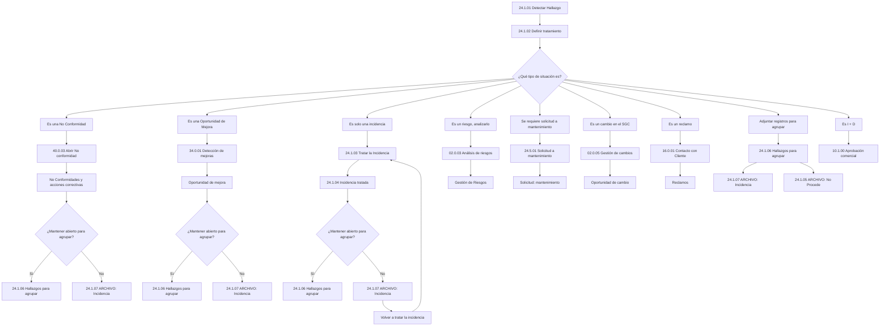

# Flujo

## Diagrama

```mermaid
flowchart TD
  %% Paso inicial
  A[24.1.01 Detectar Hallazgo] --> B[24.1.02 Definir tratamiento]

  %% Decisión principal
  B --> C{¿Qué tipo de situación es?}

  %% Opciones de tratamiento
  C --> NC[Es una No Conformidad]
  C --> OM[Es una Oportunidad de Mejora]
  C --> IN[Es solo una incidencia]
  C --> RI[Es un riesgo, analizarlo]
  C --> MANT[Se requiere solicitud a mantenimiento]
  C --> CAMBIO[Es un cambio en el SGC]
  C --> REC[Es un reclamo]
  C --> AGR[Adjuntar registros para agrupar]
  C --> ID[Es I + D]

  %% Flujo No Conformidad
  NC --> NC1[40.0.03 Abrir No conformidad]
  NC1 --> NC2[No Conformidades y acciones correctivas]
  NC2 --> AGRUPAR1{¿Mantener abierto para agrupar?}
  AGRUPAR1 -->|Sí| HALL1[24.1.06 Hallazgos para agrupar]
  AGRUPAR1 -->|No| ARCH_NC[24.1.07 ARCHIVO: Incidencia]

  %% Flujo Mejora
  OM --> OM1[34.0.01 Detección de mejoras]
  OM1 --> OM2[Oportunidad de mejora]
  OM2 --> AGRUPAR2{¿Mantener abierto para agrupar?}
  AGRUPAR2 -->|Sí| HALL2[24.1.06 Hallazgos para agrupar]
  AGRUPAR2 -->|No| ARCH_OM[24.1.07 ARCHIVO: Incidencia]

  %% Flujo Incidencia
  IN --> IN1[24.1.03 Tratar la Incidencia]
  IN1 --> IN2[24.1.04 Incidencia tratada]
  IN2 --> AGRUPAR3{¿Mantener abierto para agrupar?}
  AGRUPAR3 -->|Sí| HALL3[24.1.06 Hallazgos para agrupar]
  AGRUPAR3 -->|No| ARCH_IN[24.1.07 ARCHIVO: Incidencia]

  %% Reabrir incidencia
  ARCH_IN --> VOLVER[Volver a tratar la incidencia]
  VOLVER --> IN1

  %% Flujo Riesgo
  RI --> RI1[02.0.03 Análisis de riesgos]
  RI1 --> RI2[Gestión de Riesgos]

  %% Flujo Mantenimiento
  MANT --> MANT1[24.5.01 Solicitud a mantenimiento]
  MANT1 --> MANT2[Solicitud: mantenimiento]

  %% Flujo Cambio en el SGC
  CAMBIO --> CAMBIO1[02.0.05 Gestión de cambios]
  CAMBIO1 --> CAMBIO2[Oportunidad de cambio]

  %% Flujo Reclamo
  REC --> REC1[16.0.01 Contacto con Cliente]
  REC1 --> REC2[Reclamos]

  %% Flujo I+D
  ID --> COM[10.1.00 Aprobación comercial]

  %% Agrupación Manual
  AGR --> HALLMAN[24.1.06 Hallazgos para agrupar]
  HALLMAN --> ARCHMAN[24.1.07 ARCHIVO: Incidencia]

  %% Archivar directo
  HALLMAN --> ARCHNOPRO[24.1.05 ARCHIVO: No Procede]

```
