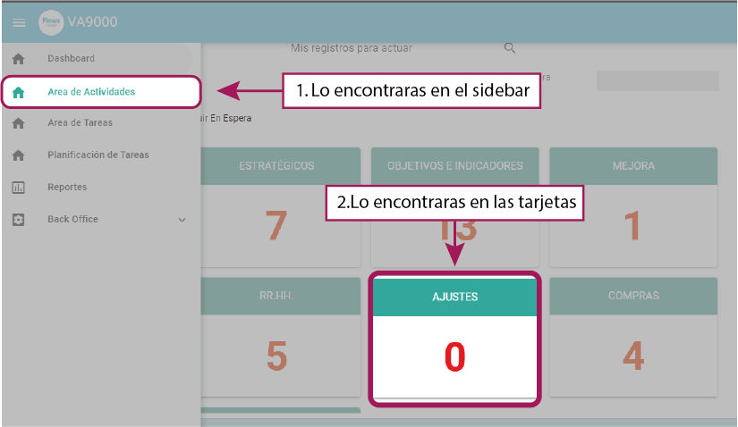
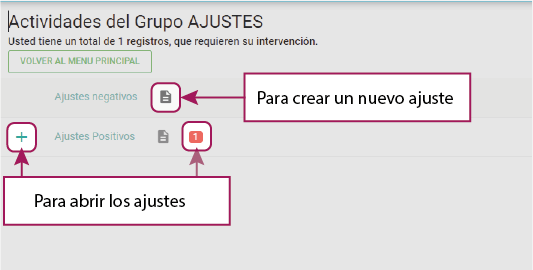
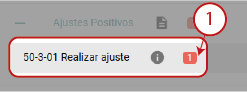
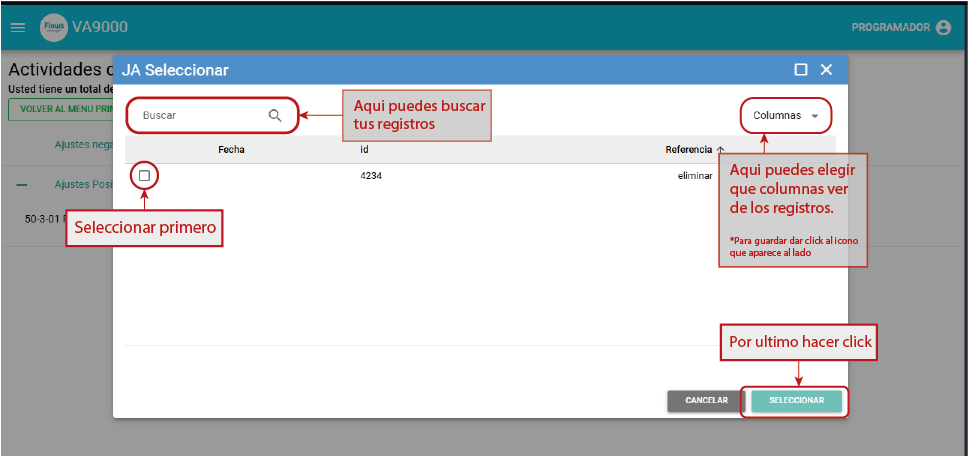

# Flujo de Ajuste

Este flujo permite realizar ajustes de varios tipos, positivos y negativos en diferentes cuentas.

La estructura de los ajustes son idénticas, cambiando únicamente el impacto del ajuste (positivo o negativo).

## 🔄 Flujo de Ajuste General (Positivo o Negativo)

La actividad o flujo lo encontraras en el - 1 ➡`Area de actividades` - y se mostrara en la tarjeta con nombre 2➡`AJUSTES`

### Inicio

Descripción: Pantalla inicial para definir el tipo de ajuste a realizar si es positivo o negativo

### Abrir los ajustes

Una vez realices click se desplegara hacia abajo los diferentes instancias del mismo ahi podrás hacer click en donde te muestra la cantidad de `rojos`

Al realizar el click se mostrara una tabla con todos los registros en la cual podrás seleccionar uno de ellos para abrirlo.
Buscar en la parte superior

:::info
Puede editar la vista de la tabla seleccionando las diferentes colomnas, puede hacer una vista momentanea, o bien guardarla para que quede de esa manera.
:::

### Nuevo Ajuste

#### **50-3-01 Realizar ajuste**
