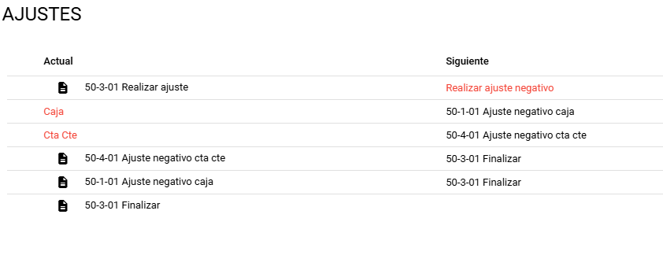

# 💸 Flujo de Ajustes en Caja y Cuenta Corriente

Los ajustes permiten corregir diferencias entre los montos reales y los registrados en el sistema, tanto en **Caja** como en **Cuenta Corriente (Cta Cte)**.

## ✅ Ajustes Positivos

> Se utiliza cuando **hay más dinero del registrado en el sistema**.  
> Ejemplos comunes: ingresos no registrados, errores de carga, transferencias duplicadas.

📈 **Impacto:** Aumenta el saldo registrado.

### 🔁 Pasos del flujo:

1. Verificar el excedente (más dinero en caja o mayor saldo real).
2. Registrar el ajuste positivo en el sistema.
3. Ingresar el motivo (ej.: "Ingreso no registrado", "Transferencia detectada").
4. El sistema **aumenta el saldo** en Caja o Cta Cte.

## ❌ Ajustes Negativos

> Se utiliza cuando **hay menos dinero del registrado en el sistema**.  
> Ejemplos comunes: egresos no registrados, errores de carga, débitos desconocidos.

📉 **Impacto:** Disminuye el saldo registrado.

### 🔁 Pasos del flujo:

1. Detectar el faltante (menos dinero físico o menor saldo bancario).
2. Registrar el ajuste negativo en el sistema.
3. Ingresar el motivo (ej.: "Faltante de caja", "Gasto sin comprobante").
4. El sistema **disminuye el saldo** en Caja o Cta Cte.

## 📝 Recomendaciones Generales

- Registrar **siempre un motivo claro** del ajuste.
- Adjuntar comprobantes si los hay (foto, recibo, etc.).
- Realizar conciliaciones periódicas para evitar acumulación de errores.
- Restringir los ajustes a usuarios autorizados.

:::warning
⚠️ Los ajustes deben ser la **última instancia** luego de intentar identificar la causa real del desbalance.
:::
