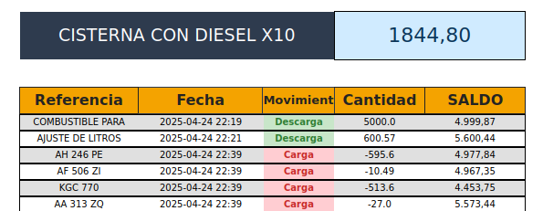
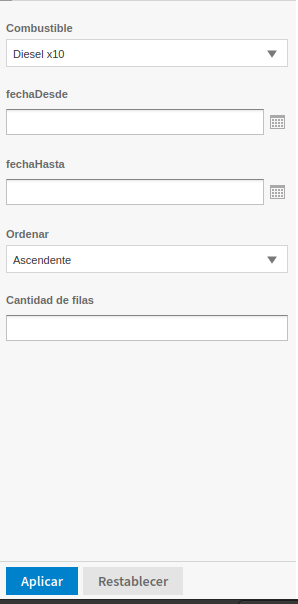

# 📘 Manual de Usuario - Reporte Detalle de Cisterna

## 🧾 Descripción del Reporte

El reporte **"Detalle de Cisterna"** permite visualizar el historial completo de movimientos de stock de un artículo específico en una cisterna determinada, mostrando el **saldo acumulado en tiempo real**.

---

## 📊 Información que Muestra el Reporte

### 🧱 Encabezado del Reporte

- 🛢️ **Nombre de la cisterna**: Muestra `"CISTERNA CON [nombre del artículo]"`
- 📦 **Total disponible**: Cantidad total disponible del artículo en la cisterna

---

### 📋 Columnas del Detalle

| Columna           | Descripción                                              |
| ----------------- | -------------------------------------------------------- |
| 🆔 **Referencia** | Código o referencia del movimiento                       |
| 📅 **Fecha**      | Fecha y hora del movimiento (formato `YYYY-MM-DD HH:MM`) |
| 🔄 **Movimiento** | Tipo de operación realizada                              |
| 🔢 **Cantidad**   | Cantidad del movimiento                                  |
| 📈 **Saldo**      | Saldo acumulado después del movimiento                   |

---

## 🧭 Tipos de Movimientos

El reporte clasifica los movimientos en tres categorías con colores distintivos:

### 🔴 **Carga (Rojo)**

- 🎨 **Fondo**: Rojo claro `#FFCDD2`
- 🖍️ **Texto**: Rojo oscuro `#C62828`
- 🧾 **Descripción**: Movimientos que **reducen el stock** de la cisterna

### 🟢 **Descarga (Verde)**

- 🎨 **Fondo**: Verde claro `#C8E6C9`
- 🖍️ **Texto**: Verde oscuro `#2E7D32`
- 🧾 **Descripción**: Movimientos que **incrementan el stock**

### 🟡 **Ajuste (Amarillo)**

- 🎨 **Fondo**: Amarillo claro `#FFE082`
- 🖍️ **Texto**: Naranja oscuro `#FF8F00`
- 🧾 **Descripción**: Ajustes **manuales de inventario**

---

## ⚙️ Parámetros del Reporte

Para generar el reporte correctamente, se deben completar los siguientes parámetros:

### 🔐 Parámetros Obligatorios

- ⛽ **`Combustible`**: ID del artículo a consultar

### 🧩 Parámetros Opcionales

- 📅 **`fechaDesde`**: Fecha de inicio del período
- 📅 **`fechaHasta`**: Fecha final del período
- ↕️ **`Ordenar`**: Ascendente o Descendente (selección por desplegable)
- 📄 **`Cantidad de filas`**: Número máximo de registros a mostrar (por defecto: 50).  
  🔸 _No tiene un límite máximo o mínimo fijo._  
  🔸 _Si se aplica un filtro por fecha, se mostrarán todos los movimientos correspondientes al rango seleccionado._

---

## 🧰 Funcionalidades Especiales

### 📆 Filtrado por Fechas

- Sin fechas: muestra los **últimos 6 meses**
- Una sola fecha: muestra los **movimientos de ese día**
- Rango: muestra **todos los movimientos en ese período**

### 📌 Límite de Registros

- 📅 **Consultas del día actual**: máximo **50 registros** (o el límite indicado)
- 📜 **Consultas históricas**: **sin límite**

### 📐 Cálculo de Saldos

- Calcula automáticamente el **saldo inicial antes del período consultado**
- Muestra el **saldo acumulado progresivo**
- Actualiza saldos en tiempo real según el tipo de movimiento

---

## 📖 Interpretación de los Datos

### 📊 Lectura del Saldo Acumulado

- ➕ **Saldo positivo**: producto disponible
- ➖ **Saldo negativo**: déficit o sobregiro
- 0️⃣ **Saldo cero**: cisterna vacía

### 🧠 Análisis de Movimientos

- Ordenados cronológicamente
- Cada fila muestra el impacto en el saldo
- Referencia útil para rastrear el origen del movimiento

---

## ✅ Casos de Uso Comunes

### 🧮 Control de Inventario

- Verificar stock actual
- Rastrear movimientos irregulares
- Analizar patrones históricos de consumo

### 🔍 Auditoría

- Validar precisión de registros
- Investigar discrepancias
- Documentar historial completo

### 📈 Planificación

- Proyección de necesidades
- Identificación de tendencias
- Optimización de niveles de stock

---

## 📌 Notas Importantes

- Datos en tiempo real desde la base actual
- Ajustes manuales claramente diferenciados
- Fechas en formato 24 horas
- Números con decimales cuando corresponda
- Colores alternos por fila para mejor lectura

---

## 🛠️ Solución de Problemas Comunes

### ❌ No aparecen datos

- Verificar ID del artículo
- Confirmar cisterna correcta
- Asegurar existencia de movimientos en el período

### ⚠️ Saldos incorrectos

- Saldos se calculan automáticamente
- Revisar integridad de datos históricos

### 🐢 Rendimiento lento

- Filtrar fechas más específicas
- Usar límite de registros para pruebas

## ❓ Preguntas Frecuentes (FAQ)

### 1. ¿Por qué no veo movimientos en mi consulta?

**🅰️ Respuesta:**
Las causas más comunes son:

- ❌ El ID del artículo no existe o es incorrecto
- 📆 No hay movimientos en el rango de fechas seleccionado
- 🛢️ El depósito/cisterna especificado no contiene el artículo
- ⏳ Los movimientos fueron realizados fuera del período de 6 meses (si no especificó fechas)

---

### 2. ¿Qué significa cuando aparece "N/A" en la columna Referencia?

**🅰️ Respuesta:**
"N/A" indica que el movimiento no tiene una referencia de texto asociada. Esto puede ocurrir con:

- 🔁 Movimientos automáticos del sistema
- 🧾 Ajustes masivos de inventario
- 📂 Movimientos antiguos sin documentación completa

---

### 3. ¿Por qué el saldo mostrado no coincide con mi sistema de inventario?

**🅰️ Respuesta:**
Posibles causas:

- ⏱️ El reporte muestra el saldo histórico en el momento específico de cada movimiento
- 📉 Pueden existir movimientos posteriores que no están incluidos en el filtro de fechas
- 🧭 Verificar que esté consultando el depósito correcto
- 📚 El cálculo considera todos los movimientos históricos, incluso anteriores al período consultado

---

### 4. ¿Cómo interpretar las cantidades negativas en el saldo?

**🅰️ Respuesta:**
Un saldo negativo indica:

- 📉 Déficit de stock en la cisterna
- ⚠️ Posible sobregiro o error en el registro
- 🛒 Necesidad de reabastecimiento urgente
- 📌 En algunos casos, puede indicar reservas o compromisos de entrega

---

### 5. ¿Puedo generar el reporte para múltiples artículos a la vez?

**🅰️ Respuesta:**
No, este reporte está diseñado para consultar **un artículo específico**. Para múltiples artículos:

- 📄 Ejecutar el reporte individualmente para cada artículo
- 🧑‍💼 Solicitar un reporte consolidado diferente al administrador del sistema

---

### 6. ¿Qué diferencia hay entre "Cantidad" y "Saldo"?

**🅰️ Respuesta:**

- 🔢 **Cantidad**: Valor del movimiento específico (positivo o negativo)
- 💰 **Saldo**: Total acumulado luego de aplicar ese movimiento

---

### 7. ¿Por qué algunos movimientos aparecen en rojo, verde o amarillo?

**🅰️ Respuesta:**
Los colores indican el tipo de movimiento:

- 🔴 **Rojo (Carga)**: Movimientos que reducen el stock
- 🟢 **Verde (Descarga)**: Movimientos que aumentan el stock
- 🟡 **Amarillo (Ajuste)**: Correcciones manuales de inventario

---

### 8. ¿Cómo puedo obtener más de 50 registros?

**🅰️ Respuesta:**

- 📆 Si consulta fechas históricas (no el día actual), el límite se elimina automáticamente
- ⚙️ Para el día actual, puede solicitar al administrador aumentar el parámetro `"limite"`
- 🗓️ Considere usar rangos de fechas más específicos para optimizar la consulta

---

### 9. ¿El reporte muestra información en tiempo real?

**🅰️ Respuesta:**
Sí, el reporte consulta directamente la base de datos actual. Sin embargo:

- ⏱️ Puede haber un pequeño retraso por procesamiento
- 🕒 Movimientos muy recientes pueden tardar unos minutos en reflejarse
- 🔁 La actualización depende de la frecuencia de sincronización del sistema

---

### 10. ¿Qué hago si el reporte tarda mucho en cargar?

**🅰️ Respuesta:**
Para mejorar el rendimiento:

- 📉 Reduzca el rango de fechas consultado
- ⚙️ Use el parámetro `"limite"` para consultas exploratorias
- 📆 Evite consultar períodos de más de 3 meses
- 🕰️ Consulte durante horarios de menor actividad del sistema

---

### 11. ¿Puedo exportar los datos a Excel?

**🅰️ Respuesta:**
Sí, dependiendo de la configuración del sistema:

- 📤 Use la opción de exportación disponible en la interfaz
- 🧑‍💼 Solicite al administrador habilitar formatos adicionales (PDF, Excel, CSV)
- 📑 También puede guardar el reporte como PDF y convertirlo posteriormente

---

### 12. ¿Qué significa el número que aparece en el encabezado junto al nombre de la cisterna?

**🅰️ Respuesta:**
Es el **total disponible actual** del artículo en la cisterna. Este valor:

- 🔄 Se calcula en tiempo real
- 🛢️ Incluye todos los depósitos de la cisterna
- 📅 Es independiente del período consultado en el detalle

---

### 13. ¿Por qué las fechas aparecen en formato 24 horas?

**🅰️ Respuesta:**
El formato 24 horas (`HH:MM`) ofrece:

- ⏱️ Mayor precisión para el control de inventario
- ❌ Eliminación de ambigüedad AM/PM
- 🌍 Estándar internacional en sistemas empresariales
- 🧾 Mejor trazabilidad de movimientos por hora

---

### 14. ¿Puedo filtrar por tipo de movimiento específico?

**🅰️ Respuesta:**
Este reporte **no incluye un filtro por tipo de movimiento**. Para obtener solo un tipo:

- 👁️ Analice visualmente los colores en el reporte
- 🧑‍💼 Solicite al administrador un reporte personalizado con ese filtro
- 🛠️ Use herramientas externas para filtrar los datos exportados

---

### 15. ¿Qué debo hacer si encuentro un error en los datos?

**🅰️ Respuesta:**
Si detecta inconsistencias:

- 📝 Documente el problema (fecha, referencia, cantidad, etc.)
- 🔍 Verifique en el sistema fuente si el error persiste
- 📬 Contacte al administrador del sistema con la información detallada
- ❗ No realice correcciones manuales sin autorización

## 🆘 Soporte Técnico

### Tips útiles para pedir ayuda

- 📸 Capturas de pantalla de errores o filtros usados
- 📅 Especificar rangos de fecha y tipo de reporte
- 📥 Exportar y compartir el Excel si es posible

📩 **Contacto de soporte**:  
[`Ingresa al formulario`](https://surl.li/kmiuwb)
