## 📅 Comportamiento de Fechas

El reporte aplica inteligentemente los rangos de fecha según lo especificado:

> [**(Ver diagrama)**]()

### 1. Filtrado por Día Específico

🔹 **Cuando se ingresa solo una fecha** (inicio o fin)  
 → Muestra exclusivamente registros del **día seleccionado**  
 _Ejemplo útil para:_

- Verificar todas las transacciones de un día particular
- Auditorías diarias rápidas

### 2. Filtrado por Rango Completo

🔹 **Cuando se especifican ambas fechas**  
 → Filtra todos los registros **entre esas fechas inclusive**  
 📌 _Recomendado para:_

- Reportes mensuales/trimestrales
- Análisis de períodos específicos

### 3. Comportamiento por Defecto

🔹 **Sin fechas ingresadas**:
| Tipo Reporte | Período Mostrado | Caso de Uso Típico |
|-------------|------------------|---------------------|
| `"compras"` | **Últimos 30 días** | Control mensual |
| `"remitos"` | **Últimos 30 días** | Control de entregas |
| `"todo"` | **Últimos 30 días** | Análisis operativo |

> #### 💡 Mejores Prácticas
>
> - Para **análisis puntual**: Usar filtro de día único
> - Para **tendencias**: Siempre definir rango completo
> - Para **reportes recurrentes**:
>
>   `Fecha Desde:` Primer día del mes   > `Fecha Hasta:` Último día del mes

### 4. **Diagrama de funcionamiento**:

```mermaid
graph TD
A[Ingreso de Fechas] --> B{¿Se ingresaron<br>ambas fechas?}
B -->|Sí| C[[Filtra rango completo:<br>Desde «FechaInicio»<br>hasta «FechaFin»]]
B -->|No| D{¿Alguna fecha<br>ingresada?}
D -->|Sí| E[[Filtra día específico:<br>«FechaUnica»]]
D -->|No| F{¿Tipo de reporte?}
F -->|compras o remitos| G[[Muestra día actual:<br>«sysdate»]]
F -->|todo| H[[Muestra últimos<br>30 días]]

style A fill:#4CAF50,stroke:#388E3C,color:white
style B fill:#2196F3,stroke:#0D47A1,color:white
style C fill:#8BC34A,stroke:#689F38,color:black
style E fill:#FFC107,stroke:#FFA000,color:black
style G fill:#9C27B0,stroke:#7B1FA2,color:white
style H fill:#673AB7,stroke:#512DA8,color:white

classDef logic fill:#607D8B,stroke:#455A64,color:white;
class B,D,F logic;
```

