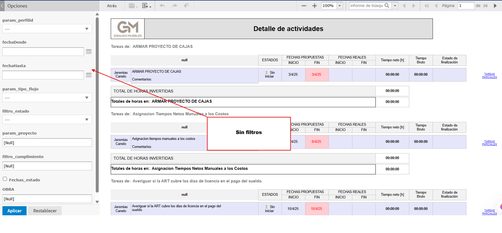
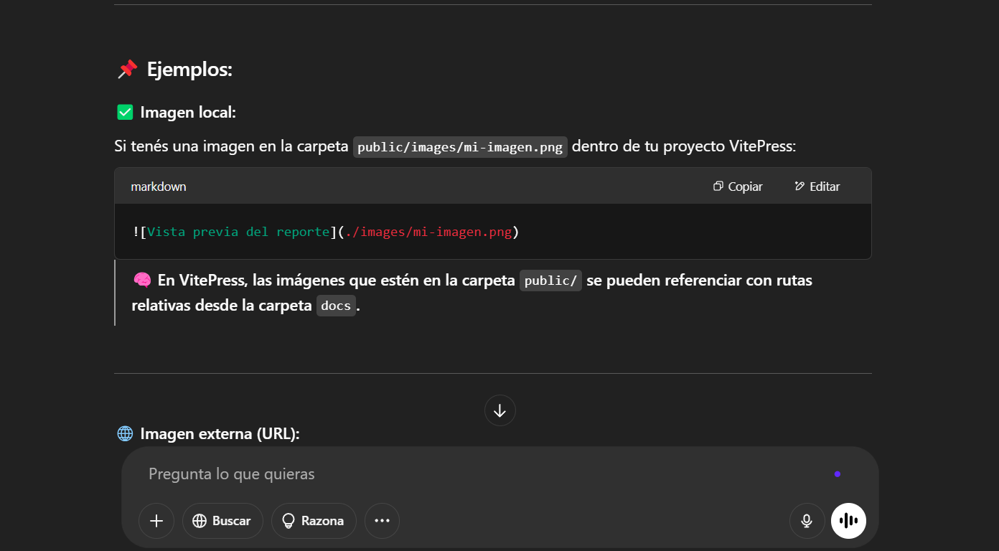

# Manual de uso

## Filtros

## FILTRO GENERAL (sin aplicar filtros de usuario)

**Finalizados:** mostrara solo las Tareas finalizadas en el último mes desde la fecha actual.

**No iniciados:** mostrara todas las treas no iniciados desde el inicio del sistema.

**Pausados:** mostrar todos los pausados desde el inicio del sistema.

## 📅 FILTRO POR FECHA (sin estado ni filtro de usuario)

# Ejemplo de filtro: del 1 al 7 de abril

**Finalizados:** mostrara solo los finalizados entre esas fechas.

**No iniciados y pausados:** mostrar desde el inicio del sistema hasta la fecha final del filtro (ej: hasta el 7 de abril).

Si la fecha de inicio y fin es la misma (ej: solo el 4): mostrara solo los de ese día exacto.

## 🔄 FILTRO POR FECHA Y ESTADO ()

Ejemplo de filtro del 1 al 7 + estado seleccionado

Estado: Finalizado → mostrar solo los finalizados entre las fechas del filtro.

Estado: Pausado o No iniciado → mostrar todos desde el inicio del sistema hasta la fecha final del filtro.

🎯 FILTRO POR ESTADO (sin fecha)
Finalizado: mostrar todo lo finalizado en el último mes.

Pausado: mostrar todos los pausados desde el inicio del sistema.

No iniciado: mostrar todos los no iniciados desde el inicio del sistema.

## Tiempo neto

EXTRACT(EPOCH FROM (LEAD(fecha) OVER (...) - fecha)) AS segundos
diferencia entre una fila y la siguiente, lo que representa cuánto tiempo estuvo activa la tarea en ese intervalo.

